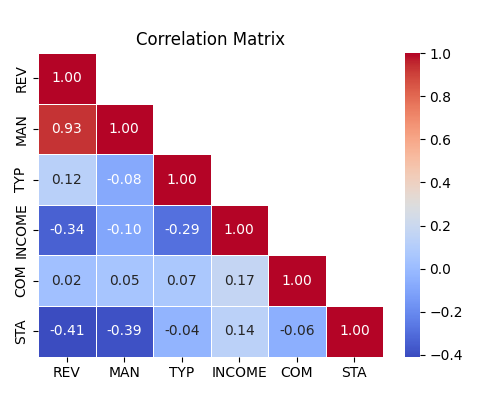

## Executive summary/ abstract 
Companion's Breweries must choose between acquiring Site A, a countryside family pub, or Site B, a disused inner-city church, to expand its pub network. A regression model, using data from 47 existing pubs, predicts revenue based on factors like Management Quality, Staff Quality, Interior Type, Regional Income, and Competition Density. Site A's projected revenue ranges from £7.12 to £10.64 million, while Site B's range is £2.02 to £5.55 million. Despite Site B's potential for premium pricing and long-term growth, Site A is recommended for its safer investment profile, established operation, and loyal staff. Further due diligence on Site A's repair costs and revenue potential is advised, while Site B may be suitable for a longer-term, ambitious project.
## Intruduction 
Companion's Breweries faces a pivotal decision on expanding its operations. This report evaluates two prospective sites, leveraging data from 47 existing pubs, to inform investment decisions. Site A, a profitable countryside pub, and Site B, a unique inner-city church conversion, present distinct opportunities and challenges. Recommendations will consider market dynamics, strategic goals, and revenue/cost analysis. Our goal is to equip Companion's Breweries with actionable insights for informed decision-making.
## Methodology
Due to the significant correlation observed between Staff Quality (STA) and Management Quality (MAN), and the strong fit of the MAN variable within the model, it was deemed appropriate to exclude the STA variable from subsequent analysis to prevent multicollinearity issues. Regarding the Competition (COM) variable, various non-linear models including X^2, Log(x), and 1/X were initially tested to explore potential relationships. However, despite these efforts, no clear pattern or relationship between COM and Revenue (REV) was discerned from the data.

## Step-by-Step Analysis Process: Evaluating Variables and Model Fit in Linear Regression
 # Step 0 : We run correlation Analysis
   