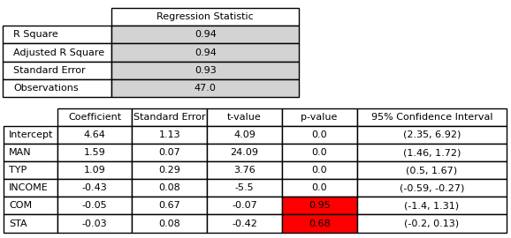

# Intruduction 
Companion's Breweries, a renowned entity in the UK brewing industry, is facing a strategic decision regarding the expansion of its operations. In line with the company's goal to extend its reach and enhance its market position, this report aims to evaluate the viability of acquiring and developing two potential new sites. Our analysis will assess the operational data of 47 existing pubs within Companion's Breweries' network to inform the decision-making process for these prospective investments. 

The first site under consideration is an old, family-owned pub located in the countryside, known for its profitability and the loyalty of its staff and patrons. The second is an unconventional opportunity to repurpose a disused inner-city church into a modern pub, an idea that has sparked much enthusiasm in our marketing department. Each site presents a unique set of opportunities and challenges, from varying levels of competition to distinct demographic profiles, which will be rigorously examined in this report. 

The recommendations will be based on a thorough analysis of the current market landscape, the company's strategic objectives, and a detailed examination of revenue and cost determinants for the existing pubs. Through this report, we aim to provide a robust foundation upon which Companion's Breweries can make an informed decision regarding these potential new ventures.

# Step-by-Step Analysis Process: Evaluating Variables and Model Fit in Linear Regression
## Step 0 : We run correlation Analysis
   
   
   From this matrix, it is clear that we have a very strong correlation between MAN and STA, which can be a significant problem in our multiple linear regression. However, we still apply it to observe that assumption.
## Step 1 : We run multi Linear Regression Analysis
   
    
   After eyeballing the results, it is clear that the p-values for COM and SAT are out of control, meaning that this regression model is not what we are looking for.
## Step 2 : We exlude SAT From Independent Variables And Run multi Linear Regression Analysis
   
   
   Even if there's a strong relationship between the dependent variable (REV) and an independent variable (MAN), it's crucial to assess for multicollinearity, which occurs when independent variables are highly correlated with each other. This can inflate standard errors and make coefficient estimates unstable, this is not a case here!
   Instead what we see is that COM is still destorying model, since we see that there is almost no correlation to the target variable, we will exclude it from the model.
## Step 3 : We exlude COM From Independent Variables And Run multi Linear Regression Analysis   
   
   
   Finally, we have obtained a model that appears quite satisfactory, with an Adjusted R-squared value of 95% and statistically significant p-values
## Step 4 : After excluding the COM variable, we observe that the model is a good fit. However, we cannot stop here; we must examine if there is a non-linear relationship
   

   Upon eyeballing the scatter plots, it becomes evident that there is no discernible relationship between the target and independent variables. Thus, we can conclude that the variable COM (competitors per kilometer) does not influence revenue generation.

   But even though we applied linear regression to each of those variables, there was no significant relationship found.

## Step 5: 
   Final regerssion equation:
 **Revenue = 4.3976 + (1.5998×MAN) − (0.4364×INCOME) + (1.0901×TYP)**

# Conclusion & Recommendations  
This report presents a detailed analysis of two potential sites for Companion's Breweries' expansion, offering a quantitative and qualitative assessment to guide the decision-making process. Site A, with its convenient location in a lower income area, lower competition, and established operation, represents a safer investment with room for growth through strategic enhancements. Conversely, Site B, despite its more challenging location that comports an overall lower demand for a pub-type establishment, could have an easier way in finding higher level management then Site A, in which case the potential revenue might be higher for that establishment. 

Recommendation: We advise prioritizing Site A due to its higher revenue related to the positioning. However, Site B should not be disregarded, a minimal research on what level of management it is possible to find in the area should be done, especially because higher competition often attracts highly specialized managers as well 

Site A is the best choice because of its location, every other variable being equal; in case it is possible to find in site B a manager of at least 3 levels of quality higher than the one in site A, it will become more profitable an investment in Site B. 